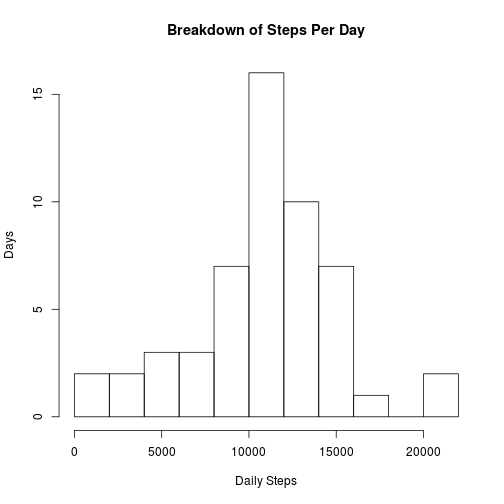

JHU Reproducible Research - Project 1
=====================================

###This report contains 4 sections:  
* General Data Loading and Processing  
* Mean Total Steps Per Day  
* Average Daily Activity Pattern  
* Imputing Missing Values  
* Differences Between Weekdays & Weekends 

___

##General Data Loading and Processing
Here, we're going to load some data from the given CSV file using read.csv().  
Additionally, we are going to transform the date into a date field.  
*This code assumes you have the data in your working directory.*


```r
data <- read.csv(file="activity.csv")
data$date <- as.Date(data$date)
summary(data)
```

```
##      steps             date               interval     
##  Min.   :  0.00   Min.   :2012-10-01   Min.   :   0.0  
##  1st Qu.:  0.00   1st Qu.:2012-10-16   1st Qu.: 588.8  
##  Median :  0.00   Median :2012-10-31   Median :1177.5  
##  Mean   : 37.38   Mean   :2012-10-31   Mean   :1177.5  
##  3rd Qu.: 12.00   3rd Qu.:2012-11-15   3rd Qu.:1766.2  
##  Max.   :806.00   Max.   :2012-11-30   Max.   :2355.0  
##  NA's   :2304
```
___

##Mean Total Steps per Day
Here, we're creating a histogram of the steps per day, as well as calculating mean and median values.  

```r
dailysteps <- aggregate(steps~date, data = data, FUN = sum)
hist(dailysteps$steps, breaks = 15, xlab = "Daily Steps", ylab = "Days", main = "Breakdown of Steps Per Day")
```



```r
paste("Mean Steps per day: ", mean(dailysteps$steps))
```

```
## [1] "Mean Steps per day:  10766.1886792453"
```

```r
paste("Median Steps per day: ", median(dailysteps$steps))
```

```
## [1] "Median Steps per day:  10765"
```
___

##Average Daily Activity Pattern
Here, we're creating a time series plot of the 5 minute intervals and average number of steps taken across all days.  
We'll also callout the 5 minute interval with the highest average steps per day.

```r
is1 <- aggregate(steps~date+interval, data = data, FUN = sum)
is2 <- aggregate(steps~interval, data = is1, FUN = mean)
plot(x = is2$interval, y = is2$steps, type = "l", xlab = "5 Min Interval", ylab = "Avg Daily Steps", main = "Avg Daily Steps by 5 Min Interval")
```


```r
paste("5 Minute Interval with Max: ", is2[which.max(is2$steps), 1])
```

```
## [1] "5 Minute Interval with Max:  835"
```
___

##Imputing Missing Values
Going to impute values for when the dataset contains *NA's*, since the presence of them may introduce biases.  
First, the total number of NA's in the dataset:  

```r
paste("Number of NA's in dataset: ", sum(is.na(data$steps)))
```

```
## [1] "Number of NA's in dataset:  2304"
```
Second, what should we do about them? I think using the **median** value for the 5 minute interval would be sufficient for this project.  
We'll calculate the median value by 5 minute interval, and then assign the NA values.  

```r
int_med_steps <- aggregate(steps~interval, data, FUN = median)
data_med <- merge(x = data, y = int_med_steps, by = 'interval')
data_med$steps.x <- ifelse(is.na(data_med$steps.x), data_med$steps.y, data_med$steps.x)
data_med <- data.frame(interval = data_med$interval, steps = data_med$steps.x, date = data_med$date)
summary(data_med)
```

```
##     interval          steps          date           
##  Min.   :   0.0   Min.   :  0   Min.   :2012-10-01  
##  1st Qu.: 588.8   1st Qu.:  0   1st Qu.:2012-10-16  
##  Median :1177.5   Median :  0   Median :2012-10-31  
##  Mean   :1177.5   Mean   : 33   Mean   :2012-10-31  
##  3rd Qu.:1766.2   3rd Qu.:  8   3rd Qu.:2012-11-15  
##  Max.   :2355.0   Max.   :806   Max.   :2012-11-30
```
Now a histogram using same metholdogy as before, but with the imputed values.

```r
dailysteps_med <- aggregate(steps~date, data = data_med, FUN = sum)
hist(dailysteps_med$steps, breaks = 15, xlab = "Daily Steps", ylab = "Days", main = "Breakdown of Steps Per Day")
```


```r
paste("Mean Steps per day: ", mean(dailysteps_med$steps))
```

```
## [1] "Mean Steps per day:  9503.86885245902"
```

```r
paste("Median Steps per day: ", median(dailysteps_med$steps))
```

```
## [1] "Median Steps per day:  10395"
```
* Essentially, we've made an assumption that the *NA's* represent time when the user was not wearing the device, and that they would have taken the same number of steps as their median for that given time interval.  
* Under that assumption, we can see that there are many "0's" that are introduced to the histogram. Previously, these values were being skipped over during analysis. The new median and mean are now lower than they were previously, and the histogram shows that the individual was actually lazier than we would have otherwise assumed.  

___
##Differences between Weekday & Weekend  
We'll be using the dataset with the imputed missing values for this part.  
  
First, creating a new variable for Weekend/Weekday:  

```r
data_med$weekday <- as.factor(ifelse(weekdays(data_med$date) == "Saturday" | 
                                   weekdays(data_med$date) == "Sunday",
                           "Weekend",
                           "Weekday"))
```
Next, we need to average the steps by weekday/weekend, as well as by interval. Then, we will create a panel plot comparing the two.  
*Just for fun, let's use ggplot2*

```r
data_med_weekday <- aggregate(steps~interval+weekday, data = data_med, FUN = mean)
library(ggplot2)
qplot(interval, steps, data = data_med_weekday, geom = "line", facets = weekday~., xlab = "5 Minute Interval", ylab = "Average Steps Taken", main = "Average Steps Taken per 5 Minute Interval")
```


___
#That concludes this project. Thank you!
